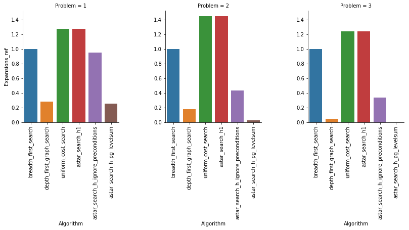
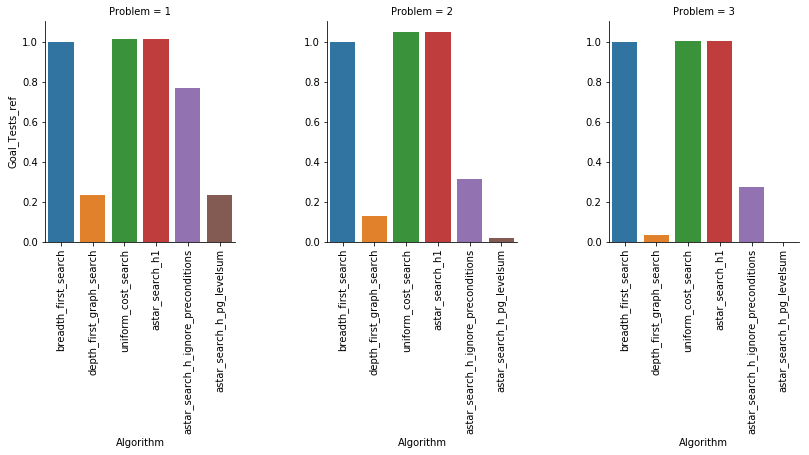
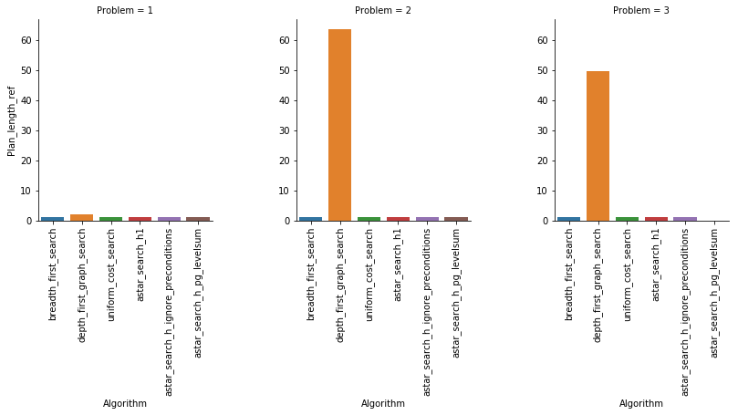
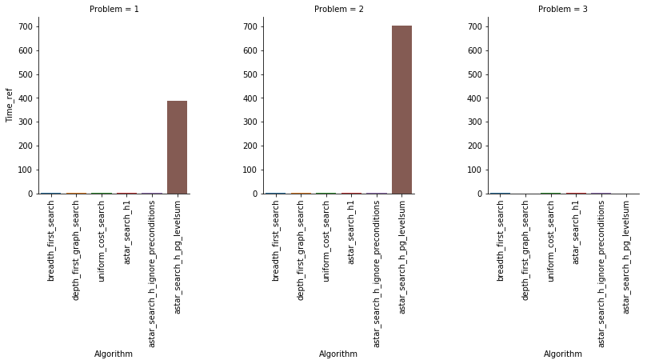

```python
# importing libraries to load the data
# Output of the models are stored in a txt file
import pandas as pd
```


```python
data = pd.read_csv('./analysis.csv')
```


```python
data
```


<div>
<style scoped>
    .dataframe tbody tr th:only-of-type {
        vertical-align: middle;
    }

    .dataframe tbody tr th {
        vertical-align: top;
    }

    .dataframe thead th {
        text-align: right;
    }
</style>
<table border="1" class="dataframe">
  <thead>
    <tr style="text-align: right;">
      <th></th>
      <th>Problem</th>
      <th>Algorithm</th>
      <th>Expansions</th>
      <th>Goal_Tests</th>
      <th>New_Nodes</th>
      <th>Plan_length</th>
      <th>Time</th>
    </tr>
  </thead>
  <tbody>
    <tr>
      <th>0</th>
      <td>1</td>
      <td>breadth_first_search</td>
      <td>43.0</td>
      <td>56.0</td>
      <td>180.0</td>
      <td>6.0</td>
      <td>0.023831</td>
    </tr>
    <tr>
      <th>1</th>
      <td>1</td>
      <td>depth_first_graph_search</td>
      <td>12.0</td>
      <td>13.0</td>
      <td>48.0</td>
      <td>12.0</td>
      <td>0.006400</td>
    </tr>
    <tr>
      <th>2</th>
      <td>1</td>
      <td>uniform_cost_search</td>
      <td>55.0</td>
      <td>57.0</td>
      <td>224.0</td>
      <td>6.0</td>
      <td>0.030609</td>
    </tr>
    <tr>
      <th>3</th>
      <td>1</td>
      <td>astar_search_h1</td>
      <td>55.0</td>
      <td>57.0</td>
      <td>224.0</td>
      <td>6.0</td>
      <td>0.029927</td>
    </tr>
    <tr>
      <th>4</th>
      <td>1</td>
      <td>astar_search_h_ignore_preconditions</td>
      <td>41.0</td>
      <td>43.0</td>
      <td>170.0</td>
      <td>6.0</td>
      <td>0.031126</td>
    </tr>
    <tr>
      <th>5</th>
      <td>1</td>
      <td>astar_search_h_pg_levelsum</td>
      <td>11.0</td>
      <td>13.0</td>
      <td>50.0</td>
      <td>6.0</td>
      <td>9.286091</td>
    </tr>
    <tr>
      <th>6</th>
      <td>2</td>
      <td>breadth_first_search</td>
      <td>3343.0</td>
      <td>4609.0</td>
      <td>30509.0</td>
      <td>9.0</td>
      <td>6.895572</td>
    </tr>
    <tr>
      <th>7</th>
      <td>2</td>
      <td>depth_first_graph_search</td>
      <td>582.0</td>
      <td>583.0</td>
      <td>5211.0</td>
      <td>575.0</td>
      <td>2.636198</td>
    </tr>
    <tr>
      <th>8</th>
      <td>2</td>
      <td>uniform_cost_search</td>
      <td>4853.0</td>
      <td>4855.0</td>
      <td>44041.0</td>
      <td>9.0</td>
      <td>9.766066</td>
    </tr>
    <tr>
      <th>9</th>
      <td>2</td>
      <td>astar_search_h1</td>
      <td>4853.0</td>
      <td>4855.0</td>
      <td>44041.0</td>
      <td>9.0</td>
      <td>9.309328</td>
    </tr>
    <tr>
      <th>10</th>
      <td>2</td>
      <td>astar_search_h_ignore_preconditions</td>
      <td>1450.0</td>
      <td>1452.0</td>
      <td>13303.0</td>
      <td>9.0</td>
      <td>3.486924</td>
    </tr>
    <tr>
      <th>11</th>
      <td>2</td>
      <td>astar_search_h_pg_levelsum</td>
      <td>86.0</td>
      <td>88.0</td>
      <td>841.0</td>
      <td>9.0</td>
      <td>4863.379718</td>
    </tr>
    <tr>
      <th>12</th>
      <td>3</td>
      <td>breadth_first_search</td>
      <td>14663.0</td>
      <td>18098.0</td>
      <td>129631.0</td>
      <td>12.0</td>
      <td>33.335785</td>
    </tr>
    <tr>
      <th>13</th>
      <td>3</td>
      <td>depth_first_graph_search</td>
      <td>627.0</td>
      <td>628.0</td>
      <td>5176.0</td>
      <td>596.0</td>
      <td>2.651550</td>
    </tr>
    <tr>
      <th>14</th>
      <td>3</td>
      <td>uniform_cost_search</td>
      <td>18233.0</td>
      <td>18235.0</td>
      <td>159697.0</td>
      <td>12.0</td>
      <td>40.964444</td>
    </tr>
    <tr>
      <th>15</th>
      <td>3</td>
      <td>astar_search_h1</td>
      <td>18233.0</td>
      <td>18235.0</td>
      <td>159697.0</td>
      <td>12.0</td>
      <td>40.981599</td>
    </tr>
    <tr>
      <th>16</th>
      <td>3</td>
      <td>astar_search_h_ignore_preconditions</td>
      <td>4951.0</td>
      <td>4953.0</td>
      <td>44051.0</td>
      <td>12.0</td>
      <td>13.015628</td>
    </tr>
    <tr>
      <th>17</th>
      <td>3</td>
      <td>astar_search_h_pg_levelsum</td>
      <td>NaN</td>
      <td>NaN</td>
      <td>NaN</td>
      <td>NaN</td>
      <td>NaN</td>
    </tr>
  </tbody>
</table>
</div>


No output was obtained in problem 3/astar_search_h_pg_levelsum even after few hours of running the program

### Per each problem I will reference the output of each model to breadth first search.


```python
problem1 = data[data['Problem']==1]
problem2 = data[data['Problem']==2]
problem3 = data[data['Problem']==3]
```


```python
for output in data.columns[2:]:
    problem1['{}_ref'.format(output)] = problem1.apply(lambda x: x[output]/problem1[(problem1['Algorithm']=='breadth_first_search') & (problem1['Problem']==1)][output], axis=1)
    problem2['{}_ref'.format(output)] = problem2.apply(lambda x: x[output]/problem2[(problem2['Algorithm']=='breadth_first_search') & (problem2['Problem']==2)][output], axis=1)
    problem3['{}_ref'.format(output)] = problem3.apply(lambda x: x[output]/problem3[(problem3['Algorithm']=='breadth_first_search') & (problem3['Problem']==3)][output], axis=1)
```

    /home/rocketheat/anaconda3/lib/python3.6/site-packages/ipykernel_launcher.py:2: SettingWithCopyWarning:
    A value is trying to be set on a copy of a slice from a DataFrame.
    Try using .loc[row_indexer,col_indexer] = value instead

    See the caveats in the documentation: http://pandas.pydata.org/pandas-docs/stable/indexing.html#indexing-view-versus-copy

    /home/rocketheat/anaconda3/lib/python3.6/site-packages/ipykernel_launcher.py:3: SettingWithCopyWarning:
    A value is trying to be set on a copy of a slice from a DataFrame.
    Try using .loc[row_indexer,col_indexer] = value instead

    See the caveats in the documentation: http://pandas.pydata.org/pandas-docs/stable/indexing.html#indexing-view-versus-copy
      This is separate from the ipykernel package so we can avoid doing imports until
    /home/rocketheat/anaconda3/lib/python3.6/site-packages/ipykernel_launcher.py:4: SettingWithCopyWarning:
    A value is trying to be set on a copy of a slice from a DataFrame.
    Try using .loc[row_indexer,col_indexer] = value instead

    See the caveats in the documentation: http://pandas.pydata.org/pandas-docs/stable/indexing.html#indexing-view-versus-copy
      after removing the cwd from sys.path.


```python
combined = pd.concat([problem1, problem2, problem3])
```

## Expansions


```python
import matplotlib.pyplot as plt
import seaborn as sns
%matplotlib inline

g = sns.factorplot(x="Algorithm", y="Expansions_ref", col='Problem', data=combined, kind='bar')
g.set_xticklabels(rotation=90)
```


    <seaborn.axisgrid.FacetGrid at 0x7f14e1d10b00>





## Goal Tests


```python
g = sns.factorplot(x="Algorithm", y="Goal_Tests_ref", col='Problem', data=combined, kind='bar')
g.set_xticklabels(rotation=90)
```


    <seaborn.axisgrid.FacetGrid at 0x7f14e0fc6c50>





## New Nodes


```python
g = sns.factorplot(x="Algorithm", y="New_Nodes_ref", col='Problem', data=combined, kind='bar')
g.set_xticklabels(rotation=90)
```


    <seaborn.axisgrid.FacetGrid at 0x7f14e0f77390>


## Plan Length


```python
g = sns.factorplot(x="Algorithm", y="Plan_length_ref", col='Problem', data=combined, kind='bar')
g.set_xticklabels(rotation=90)
```


    <seaborn.axisgrid.FacetGrid at 0x7f14e033eb00>





## Time


```python
g = sns.factorplot(x="Algorithm", y="Time_ref", col='Problem', data=combined, kind='bar')
g.set_xticklabels(rotation=90)
```


    <seaborn.axisgrid.FacetGrid at 0x7f14e0c3b6d8>





## The Optimal Solution for Problem 1, 2, 3

### Problem 1:
As provided in the homework
Load(C1, P1, SFO)
Fly(P1, SFO, JFK)
Unload(C1, P1, JFK)
Load(C2, P2, JFK)
Fly(P2, JFK, SFO)
Unload(C2, P2, SFO

================================
### Problem 2:
Load(C3, P3, ATL)
Fly(P3, ATL, SFO)
Unload(C3, P3, SFO)
Load(C2, P2, JFK)
Fly(P2, JFK, SFO)
Unload(C2, P2, SFO)
Load(C1, P1, SFO)
Fly(P1, SFO, JFK)
Unload(C1, P1, JFK)

================================
### Problem 3:
Load(C1, P1, SFO)
Fly(P1, SFO, ATL)
Load(C3, P1, ATL)
Fly(P1, ATL, JFK)
Unload(C1, P1, JFK)
Unload(C3, P1, JFK)
Load(C2, P2, JFK)
Fly(P2, JFK, ORD)
Load(C4, P2, ORD)
Fly(P2, ORD, SFO)
Unload(C4, P2, SFO)
Unload(C2, P2, SFO)

## Summary of the Data:

### Several Observations:
1. It is clearly Depth Search Algorithm does reach the goal very efficently from a time stand point. However it is significantly longer than any other search algorithm
2. Surprisingly the levelsum heristic was extremely inefficent from a time stand point. This comes form the concept of even a little more computation in the setting of a large search space increase exponentially. I couldn't even get the time data for the Problem 3 as I waited few hours without output
3. I think from the non-heuristic search algorithms the unifrom-cost-search did very well from all features
4. Overall it seems to me the A* with h_ignore_preconditions heuristic did the best. This makes sense considering how powerful A* algoirthm by combining the cost of search and a 'simple' heurisitc as opposed to levelsum.

### Explanation:
1. per the video and AIMA p:105-106. The search space is calcuated by $b^d$ where d is the depth search and b is the effective branching factor. We can easily realize the exponential component of this equation. This clearly explain why even adding a little depth would lead to a significant increase in the search space.
2. As noted in the video depth-first search would reach a goal if the search space is finite, while this become impossible in the infinite space. This is not the case in Breadth-first and Uniform_search Algorithms.
3. In the setting of enough time and computing resources, level sum heuristic is a great tool. Some of the advantagees it dominates the max-level heuristics and works well when there are good interactions among subplans. Disadvantages it ignores interactions among three or more literals (AIMA p:389). I would also add it is time consuming considering the additional computation that happens for the heurisitc funtion. The computation however is much simpler in due to the simple counter function utilized by the algorithm.  

### Conclusion:
I think if time and computation is not a problem then I would pick astar_search_h_pg_levelsum. It seems if offers the least search space and the shortest solution. If however time and computation is limited then astar_search_h_ignore_preconditions is a great.

## References:
1. Artificial Intelligence A Modern Approach, Third Edition.
2. Artificial Intelligence Foundations of Computational Agents.
